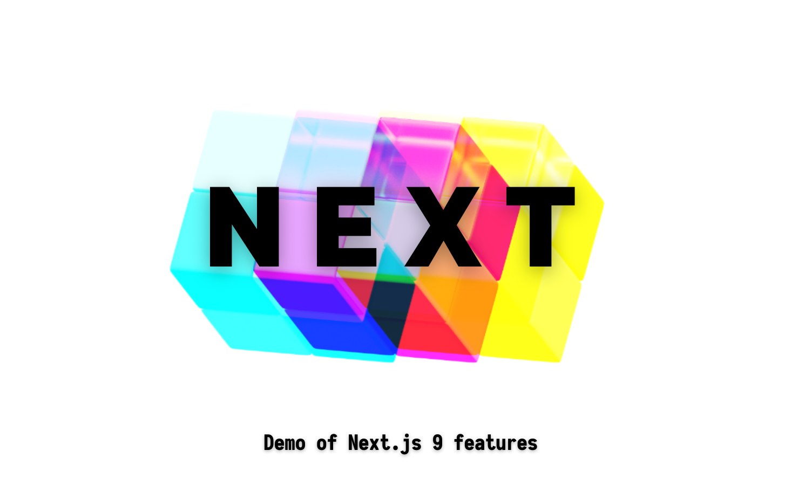

# Next 9

This is a demonstration of Next.js 9 features.



## About

Next.js is a fantastic framework that allows us to build performant server-side rendered React apps with ease.

In this repo, you will find ways how you can utilize the powerful features of [Next.js 9](https://nextjs.org/),
like **API routes** and **Static Site Generation (SSG)** to build full-stack React apps.

Also it use [Auth0](https://auth0.com/) to handle user *authentication* and *authorization*,
and also Chakra UI component library is integrated for better look.
into our Next.js project to make it a breeze to build beautiful and modularized user interfaces

## To run

To run this project you'll need:

- yarn
- node

To start development server simply type following in your terminal:

```bash
yarn dev
```

All other scripts you'll find under **Scripts** section.

### Auth0

This section is optional. It's needed to enable a *secret page*
(protected by `auth0`).

Create an `env` file with following records, you can get these
[here](https://auth0.com):

- `AUTH0_DOMAIN` - domain for `auth0` server
- `AUTH0_CLIENT_ID` - id of `auth0` client;
- `AUTH0_CLIENT_SECRET` - secret for `auth0` client;
- `SESSION_COOKIE_SECRET` - to encrypt cookies. You can generate one with

    ```bash
    openssl rand -base64 32
    ```

## Routes

There is complete list of all routes:

- `/home` - displays home page
- `/about` - displays about page
- `/about/me` - displays *nested* route
- `/user/:id` - displays *dynamic* route when `id` is specified.
    It also can parse *parametrs queries*. Try

    ```ulr
    http://localhost:3000/user/1?action=create&darkmode=false
    ```

    or if this `id` doesn't exist you'll become an error. Try

    ```ulr
    http://localhost:3000/user/100?action=create&darkmode=false
    ```
- `/secret` - some *secret*. User needs to be logged in to see it. (Needs `.env` file)

## Endpoints

There is complete list of all endpoints:

| Enpoint          | Method        | Params                      | Description                          |
| ---------------- |:-------------:| :-------------------------- | ------------------------------------ |
| `/api/hello`     | `GET`         | -                           | Returns hello message                |
| `/api/user/:id`  | `GET`         | `id` of type `Number`       | Returns info about user with `id`    |
| `/api/callback`  | `GET`         | `code` and `state` as query | Handles callback from `auth` service |
| `/api/login`     | `GET`         | -                           | Starts login process                 |
| `/api/logout`    | `GET`         | -                           | Starts logout process                |

## Scripts

In the project directory, you can run:

### `yarn dev`

Runs the next app in the development mode.  
Open [http://localhost:3000](http://localhost:3000) to view it in the browser.

The page will reload if you make edits.  
You will also see any lint errors in the console.

### `yarn build`

Builds the next app for production to the `build` folder.  
It correctly bundles React in production mode and optimizes the build for the best performance.

The build is minified and the filenames include the hashes.  
Your app is ready to be deployed!

### `yarn start`

Runs the next app in the production mode.

### `yarn export`

Exports the next app as static version of the site to `out` directory.

## Techologies

- React
- Next
- Chakra UI
- SWR
- Auth0

## Meta

Sierikov Artem – [twitter](https://twitter.com/sierikov_)

## Contribute

1. Fork it (<https://github.com/sierikov/prisma/fork>)
1. Create your feature branch (`git checkout -b feature/fooBar`)
1. Commit your changes (`git commit -am 'Add some fooBar'`)
1. Push to the branch (`git push origin feature/fooBar`)
1. Create a new Pull Request
